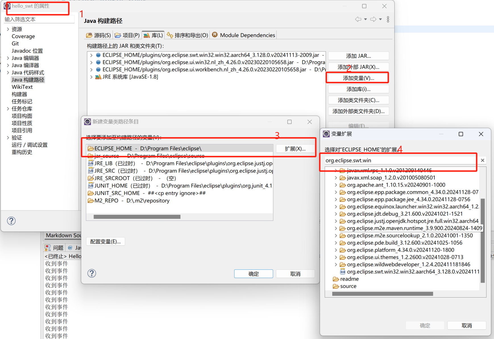
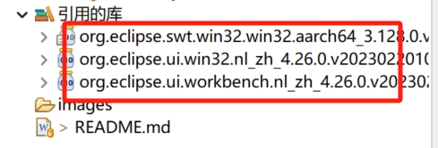
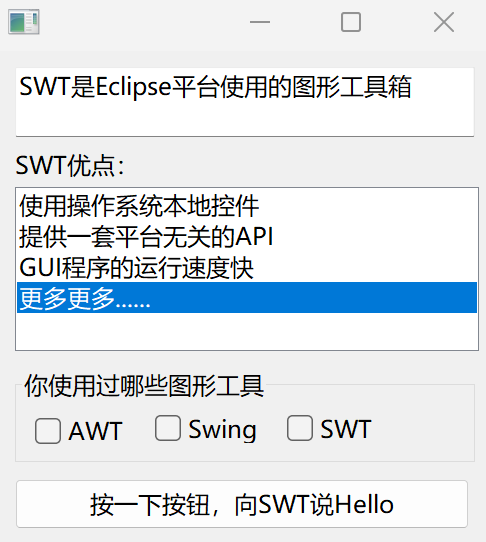

# eclipse-plugin-study
Eclipse插件开发学习笔记

## 1. 引入swt环境
引入SWT插件

该项目引入了如下3个插件：

## 2. 第一个SWT 示例
HelloSWT

## 3. MultipleDisplayException
多线程访问同一个Display实例，异常
一个Display实例，只能被一个线程访问

## 4. TextData
是用Text中的setData来存储控制数据，并在后续读取使用

## 5. ColorLabel
使用Color来设置控件的颜色

## 6. ImageTest
使用图片，给控件增加图标，增加背景图片等

## 7. FontTest
使用系统内置字体，自定义字体，给控件增加字体

##8. TrayTest
托盘图标，提示词，菜单

##9. RegionTest
用Region 构造不同规则的窗口
Region类型表示由任意个多边形组成的一个区域

##10. SWT_Swing_Test
在SWT 中使用swing 控件
